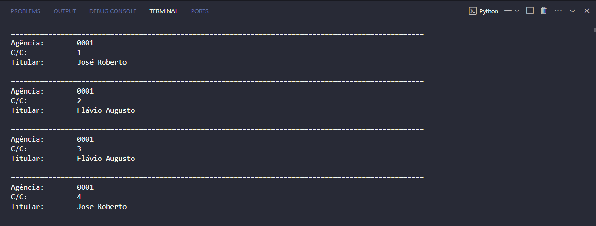
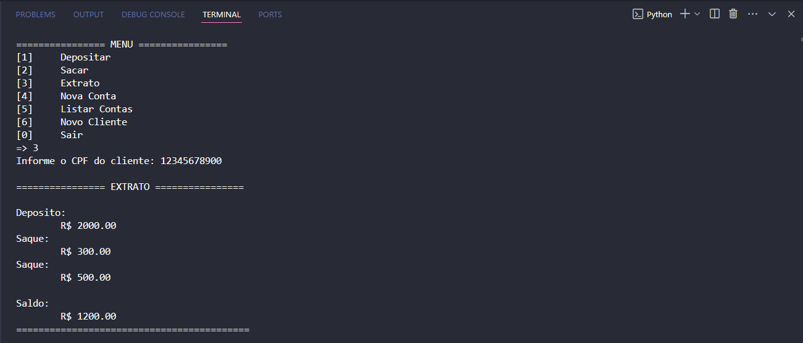

# Modelando-Sistema-Bancario-em-POO-com-Python

Neste projeto irei modelar o sistema bancário criado no desafio anterior utlizando os conceitos de Programação Orientada a Objetos(POO).

- Curso: Python Development
- Instrutor: Guilherme Arthur de Carvalho
- Instituição: [DIO.me](https://www.dio.me/)
- Repositório do Projeto Anterior: https://github.com/Danieltandrade/Otimizando-Sistema-Bancario-Com-Python
- Editor de Código: 

## Desafio

### Objetivo:

O desafio consiste em modelar o sistema bancário utilizando o paradigma de __Programação Orientado a Objetos__. Para o projeto atual, as funções de deposito, saques e extrato foram modificadas para estarem ligadas a um cliente e uma conta. A conta possuí limites de saque e quantidade máxima de transações diárias conforme definições do banco:

- Valor máximo por saque: R$ 500,00
- Quantidade máxima de saques por dia: 3 saques.

### Operações:

O sistema deve listar todos os depósitos e saques realizados na conta. Também deve apresentar os comandos para cadastro de novos clientes, cadastro de novas contas e listagem de contas.

## Criando Repositório

Primeiramente criei o repositório no __GitHub__ com nome __"Modelando-Sistema-Bancario-em-POO-com-Python"__ e clonei o repositório para meu PC utilizando o __GitHub Desktop__.

## Criando o Projeto

Com __VS Code__ aberto, criei a pasta __"SRC"__ para conter os arquivos do projeto. Após a pasta criada, criei o arquivo __"main.py"__, onde irei criar o código principal e o arquivo __"classes.py"__ aonde serão criadas as classes utlizadas pelo arquivo principal.

### Arquivo main.py

- Inicialmente importei os módulos __classes__ e __textwrap__.

- No próximo passo criei uma mensagem de boas vindas e em seguida declarei todas as funções que serão chamadas para execução do sistema. Vide lista de todas as funções criadas:

    01. def menu() - Função para listar as opções de menu.
    02. def filtrar_cliente(cpf, clientes) - Função para filtar e verificar se o cliente já está cadastrado.
    03. def recuperar_conta_cliente(cliente) - Função para verificar se o cliente possuí conta.
    04. def depositar(clientes) - Função para realizar depositos na conta do cliente.
    05. def sacar(clientes) - Função para realizar saques da conta do cliente.
    06. def exibir_extrato(clientes) - Função para exibir o extrato bancário da conta do cliente.
    07. def criar_cliente(clientes) - Função para cadastrar novos clientes.
    08. def criar_conta(numero_conta, clientes, contas) - Função para cadastrar nova conta para o cliente.
    09. def listar_contas(contas) - Função para listar todas as contas cadastradas.
    10. def main() - Função principal.

- Na última linha do código, é chamada a função "main()" para que o código seja executado e as funções de acordo com as escolhas do "menu".

### Arquivo classes.py

- Este arquivo é um módulo, onde estão as classes que serão usadas no arquivo principal __main.py__.

- Para o desafio o instrutor nos passou uma imagem com o modelo de classes __UML__ do projeto. Este modelo pode ser visto na imagem abaixo:

- No início do código, importei os módulos __abc__ e __datetime__.

- As classes foram criadas de acordo com o modelo de classes __UML__ e estão listadas abaixo:

    1. class Cliente
    2. class PessoaFisica(Cliente)
    3. class Conta:
    4. class ContaCorrente(Conta)
    5. class Historico:
    6. class Transacao(ABC)
    7. class Saque(Transacao)
    8. class Deposito(Transacao)

- Aqui são explorados os conceitos de classes e POO, contendo classes pai e filha, polimorfismo e classe abstrata.

## Testes

O sistema bancário se comportou da maneira esperada, sempre pedindo o número de CPF para verificar se o cliente está cadastrado e se possuí conta para realzar as operações de deposito, saque e extrato. A função "listar_contas" também funcionou, listando todas as contas cadastradas.

__1º teste:__ Realização de cadastro de clientes, cadastro de contas e apresentação da lista de contas cadastradas. Cada nova conta cadastrada recebe um número em sequencia, com o cliente podendo ter várias contas. Vide __imagem 1__ abaixo mostrando o teste com as contas cadastradas:

 Imagem 1

__2º teste:__ Testando as funções de deposito, saque e extrato. O sistema deve bloquear qualquer operação que fuja as regras do banco mencionadas anteriormente. Vide __imagem 2__ abaixo mostrando o teste das funções deposito, saque e extrato:

 Imagem 2

## Conclusão

Este foi o meu terceiro projeto de __Liguagem Python__ dentro do curso __Python Development__ e confesso que foi muito mais desafiador que eu imaginei. Tentei primeiramente realizar o desafio sozinho, mas não consegui e tive que ver a resolução do instrutor para conseguir terminar o meu projeto. Programar orientado a objetos esta sendo uma experiência de grande aprendizado e quero me aprofundar mais neste paradigma de programação.
Grande abraço a todos!!!

## Linguagens de Marcação e Programação

- 

- 

## Ferramentas e Serviços

- 

- 

- 